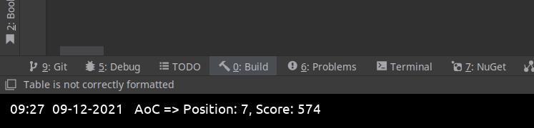

## Polybar script

I have created a simple [`jq`](https://stedolan.github.io/jq/) [script](./polybar/adventofcode_polybar.sh) to show my position on a private leaderboard on my [polybar](https://github.com/polybar/polybar):

# Advent Of Code 2022

## Solutions

| Day | Solutions                                                                                                                                                                                                                  | 
|-----|----------------------------------------------------------------------------------------------------------------------------------------------------------------------------------------------------------------------------|
| 1   | [Rust](https://github.com/jacobduijzer/AdventOfCode/blob/main/rust/src/year2022/day01.rs) - [Bash](https://github.com/jacobduijzer/AdventOfCode/tree/main/bash/2022/day01) |
| 2   | [Rust](https://github.com/jacobduijzer/AdventOfCode/blob/main/rust/src/year2022/day02.rs) |
| 3   | [Rust](https://github.com/jacobduijzer/AdventOfCode/blob/main/rust/src/year2022/day03.rs) |
| 4   | [Rust](https://github.com/jacobduijzer/AdventOfCode/blob/main/rust/src/year2022/day04.rs) |
| 5   | [Rust](https://github.com/jacobduijzer/AdventOfCode/blob/main/rust/src/year2022/day05.rs) |
| 6   | [Rust](https://github.com/jacobduijzer/AdventOfCode/blob/main/rust/src/year2022/day06.rs) |
| 7   | [Rust](https://github.com/jacobduijzer/AdventOfCode/blob/main/rust/src/year2022/day07.rs) |
| 8   | [Rust](https://github.com/jacobduijzer/AdventOfCode/blob/main/rust/src/year2022/day08.rs) |
| 9   | [Rust](https://github.com/jacobduijzer/AdventOfCode/blob/main/rust/src/year2022/day09.rs) |
| 10  | [Rust](https://github.com/jacobduijzer/AdventOfCode/blob/main/rust/src/year2022/day10.rs) |
| 13  | [Rust](https://github.com/jacobduijzer/AdventOfCode/blob/main/rust/src/year2022/day13.rs) |
| 14  | [Rust](https://github.com/jacobduijzer/AdventOfCode/blob/main/rust/src/year2022/day14.rs) |
| 15  | [Rust](https://github.com/jacobduijzer/AdventOfCode/blob/main/rust/src/year2022/day15.rs) |
| 17  | [Rust](https://github.com/jacobduijzer/AdventOfCode/blob/main/rust/src/year2022/day17.rs) |
| 18  | [Rust](https://github.com/jacobduijzer/AdventOfCode/blob/main/rust/src/year2022/day18.rs) |

# Advent Of Code 2021

## Solutions

| Day | Solutions                                                                                                                                                                                                                  | 
|-----|----------------------------------------------------------------------------------------------------------------------------------------------------------------------------------------------------------------------------|
| 1   | [F#](https://github.com/jacobduijzer/AdventOfCode/blob/main/fsharp/AdventOfCode/Puzzles/Day01.fs) - [Bash](https://github.com/jacobduijzer/AdventOfCode2021/tree/main/bash/day01) - [Rust](https://github.com/jacobduijzer/AdventOfCode/blob/main/rust/src/year2021/day01.rs)                                    |
| 2   | [F#](https://github.com/jacobduijzer/AdventOfCode/blob/main/fsharp/AdventOfCode/Puzzles/Day02.fs) - [Rust](https://github.com/jacobduijzer/AdventOfCode/blob/main/rust/src/year2021/day02.rs)                                                                                                                    |
| 3   | Created on a different computer, forgot to check in. Need to look for it                                                                                                                                                   |
| 4   | [C#](https://github.com/jacobduijzer/AdventOfCode/blob/main/csharp/AdventOfCode.Core/Puzzles/Day04/Solution.cs) - [F#](https://github.com/jacobduijzer/AdventOfCode2021/blob/main/fsharp/AdventOfCode/Puzzles/Day04.fs) |
| 5   | [C#](https://github.com/jacobduijzer/AdventOfCode/blob/main/csharp/AdventOfCode.Core/Puzzles/Day05/Solution.cs)                                                                                                        |
| 6   | [C#](https://github.com/jacobduijzer/AdventOfCode/blob/main/csharp/AdventOfCode.Core/Puzzles/Day06/Solution.cs)                                                                                                        |
| 7   | [C#](https://github.com/jacobduijzer/AdventOfCode/blob/main/csharp/AdventOfCode.Core/Puzzles/Day07/Solution.cs) - [F#](https://github.com/jacobduijzer/AdventOfCode2021/blob/main/fsharp/AdventOfCode/Puzzles/Day07.fs) |
| 8   | [C#](https://github.com/jacobduijzer/AdventOfCode/blob/main/csharp/AdventOfCode.Core/Puzzles/Day08/Solution.cs)                                                                                                        |
| 9   | [C#](https://github.com/jacobduijzer/AdventOfCode/blob/main/csharp/AdventOfCode.Core/Puzzles/Day09/Solution.cs)                                                                                                        |
| 10  | TODO: merge from different laptop                                                                                                                                                                                          |
| 11  | [C#](https://github.com/jacobduijzer/AdventOfCode/blob/main/csharp/AdventOfCode.Core/Puzzles/Day11/Solution.cs)                                                                                                        |
| 12  | [C#](https://github.com/jacobduijzer/AdventOfCode/blob/main/csharp/AdventOfCode.Core/Puzzles/Day12/Solution.cs)                                                                                                        |
| 13  | [C#](https://github.com/jacobduijzer/AdventOfCode/blob/main/csharp/AdventOfCode.Core/Puzzles/Day13/Solution.cs)                                                                                                        |
| 14  | [C#](https://github.com/jacobduijzer/AdventOfCode/blob/main/csharp/AdventOfCode.Core/Puzzles/Day14/Solution.cs)                                                                                                        |
| 15  | [C#](https://github.com/jacobduijzer/AdventOfCode/blob/main/csharp/AdventOfCode.Core/Puzzles/Day15/Solution.cs)                                                                                                        |
| 16  | [C#](https://github.com/jacobduijzer/AdventOfCode/blob/main/csharp/AdventOfCode.Core/Puzzles/Day16/Solution.cs)                                                                                                        |
| 17  | [C#](https://github.com/jacobduijzer/AdventOfCode/blob/main/csharp/AdventOfCode.Core/Puzzles/Day17/Solution.cs)                                                                                                        |
| 18  | [C#](https://github.com/jacobduijzer/AdventOfCode/blob/main/csharp/AdventOfCode.Core/Puzzles/Day18/Solution.cs)                                                                                                        |
| 19  | [C#](https://github.com/jacobduijzer/AdventOfCode/blob/main/csharp/AdventOfCode.Core/Puzzles/Day19/Solution.cs)                                                                                                        |
| 20  | [C#](https://github.com/jacobduijzer/AdventOfCode/blob/main/csharp/AdventOfCode.Core/Puzzles/Day20/Solution.cs)                                                                                                        |
| 21  | [C#](https://github.com/jacobduijzer/AdventOfCode/blob/main/csharp/AdventOfCode.Core/Puzzles/Day21/Solution.cs)                                                                                                        |
| 22  | [C#](https://github.com/jacobduijzer/AdventOfCode/blob/main/csharp/AdventOfCode.Core/Puzzles/Day22/Solution.cs)                                                                                                        |
| 23  | [C#](https://github.com/jacobduijzer/AdventOfCode/blob/main/csharp/AdventOfCode.Core/Puzzles/Day23/Solution.cs)                                                                                                        |

