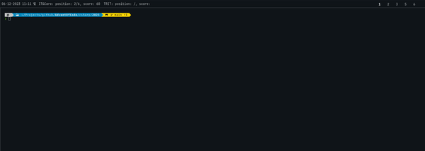
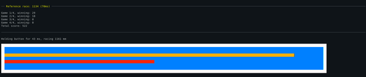

[](https://github.com/jacobduijzer/AdventOfCode/actions/workflows/typescript.yml) [](https://github.com/jacobduijzer/AdventOfCode/actions/workflows/rust.yml) [](https://github.com/jacobduijzer/AdventOfCode/actions/workflows/csharp.yml) [](https://github.com/jacobduijzer/AdventOfCode/actions/workflows/csharp-2024.yml)

## Leaderboard script

I have created a bash script to extract my position on a leaderboard, I use it to show it on my desktop (previously Polybar, now Waybar):


### Usage of the leaderboard script

```bash
./adventofcode.sh -c ~/.aoc_cookie.txt -i 123456 -n "Jacob Duijzer" -l "Team Rockstars IT"

Parameters:

-c cookie_file: the location of a text file with the contents of the AoC cookie.
-i id: the id of the leaderboard.
-n "name": the name of the player you want to show the score for.
-l "label": the name of the leaderboard.

```

# Advent of Code 2024

## Solutions

| Day | Solutions                                                                                                |
|-----|----------------------------------------------------------------------------------------------------------|
| 1   | [Typescript](https://github.com/jacobduijzer/AdventOfCode/blob/main/typescript/years/2024/01/index.ts) - [C#](https://github.com/jacobduijzer/AdventOfCode/blob/main/csharp/2024/src/AdventOfCode.Specs/Day01.feature) |
| 2   | [Typescript](https://github.com/jacobduijzer/AdventOfCode/blob/main/typescript/years/2024/02/index.ts)   |
| 3   | [Typescript](https://github.com/jacobduijzer/AdventOfCode/blob/main/typescript/years/2024/03/index.ts)   |
| 4   | [Typescript](https://github.com/jacobduijzer/AdventOfCode/blob/main/typescript/years/2024/04/index.ts)   |
| 5   | [Typescript](https://github.com/jacobduijzer/AdventOfCode/blob/main/typescript/years/2024/05/index.ts)   |
| 6   | [Typescript](https://github.com/jacobduijzer/AdventOfCode/blob/main/typescript/years/2024/06/index.ts) - [C#](https://github.com/jacobduijzer/AdventOfCode/blob/main/csharp/2024/src/AdventOfCode.Specs/Day06.feature) |  
| 7   | [Typescript](https://github.com/jacobduijzer/AdventOfCode/blob/main/typescript/years/2024/07/index.ts)   |
| 8   | [Typescript](https://github.com/jacobduijzer/AdventOfCode/blob/main/typescript/years/2024/08/index.ts)   |
| 9   | [Typescript](https://github.com/jacobduijzer/AdventOfCode/blob/main/typescript/years/2024/09/index.ts)   |      
| 10  | [Typescript](https://github.com/jacobduijzer/AdventOfCode/blob/main/typescript/years/2024/10/index.ts)   |
| 11  | [Typescript](https://github.com/jacobduijzer/AdventOfCode/blob/main/typescript/years/2024/11/index.ts)   |
| 12  | |
| 13  | [Typescript](https://github.com/jacobduijzer/AdventOfCode/blob/main/typescript/years/2024/13/index.ts)   |
| 14  | |
| 15  | [Typescript](https://github.com/jacobduijzer/AdventOfCode/blob/main/typescript/years/2024/15/index.ts)   |
| 16  | [Typescript](https://github.com/jacobduijzer/AdventOfCode/blob/main/typescript/years/2024/16/index.ts)   |
| 17  | [Typescript](https://github.com/jacobduijzer/AdventOfCode/blob/main/typescript/years/2024/17/index.ts)   | 
| 18  | [Typescript](https://github.com/jacobduijzer/AdventOfCode/blob/main/typescript/years/2024/18/index.ts)   | 
| 19  | [Typescript](https://github.com/jacobduijzer/AdventOfCode/blob/main/typescript/years/2024/19/index.ts)   |

# Advent of Code 2023

## Solutions

| Day | Solutions                                                                                                                                                                                                                                                                                                      | 
|-----|----------------------------------------------------------------------------------------------------------------------------------------------------------------------------------------------------------------------------------------------------------------------------------------------------------------|
| 1   | [Rust](https://github.com/jacobduijzer/AdventOfCode/blob/main/rust/src/year2023/day01.rs) - [Bash - Part 1](https://github.com/jacobduijzer/AdventOfCode/tree/main/bash/2023/day01/solve_part1.sh) - [C#](https://github.com/jacobduijzer/AdventOfCode/blob/main/csharp/2023/src/AdventOfCode2023.Core/day01/) |
| 2   | [Rust](https://github.com/jacobduijzer/AdventOfCode/blob/main/rust/src/year2023/day02.rs) - [C#](https://github.com/jacobduijzer/AdventOfCode/blob/main/csharp/2023/src/AdventOfCode2023.Core/day02/)                                                                                                 |
| 3   | [Rust](https://github.com/jacobduijzer/AdventOfCode/blob/main/rust/src/year2023/day03.rs) |
| 4   | [Rust](https://github.com/jacobduijzer/AdventOfCode/blob/main/rust/src/year2023/day04.rs) - [C# - Part 1](https://github.com/jacobduijzer/AdventOfCode/tree/main/csharp/2023/src/AdventOfCode2023.Core/day04) |
| 5   | [Rust](https://github.com/jacobduijzer/AdventOfCode/blob/main/rust/src/year2023/day05.rs) |
| 6   | [Rust](https://github.com/jacobduijzer/AdventOfCode/blob/main/rust/src/year2023/day06.rs) - [C# - Part 1](https://github.com/jacobduijzer/AdventOfCode/tree/main/csharp/2023/src/AdventOfCode2023.Core/day06) |
| 7   | [Rust](https://github.com/jacobduijzer/AdventOfCode/blob/main/rust/src/year2023/day07.rs) |
| 8   | [Rust](https://github.com/jacobduijzer/AdventOfCode/blob/main/rust/src/year2023/day08.rs) |
| 9   | [Rust](https://github.com/jacobduijzer/AdventOfCode/blob/main/rust/src/year2023/day09.rs) |
| 10   | |
| 11   | [Rust](https://github.com/jacobduijzer/AdventOfCode/blob/main/rust/src/year2023/day11.rs) |
| 12   | [Rust](https://github.com/jacobduijzer/AdventOfCode/blob/main/rust/src/year2023/day12.rs) |
| 18   | [Rust](https://github.com/jacobduijzer/AdventOfCode/blob/main/rust/src/year2023/day18.rs) |

## Visualizations

All visualizations are done with C# solutions, using [Spectre.Console](https://spectreconsole.net).

Day 1:



Day 2:


Day 4, part 1:


Day 6, part 1:




# Advent Of Code 2022

## Solutions

| Day | Solutions                                                                                                                                                                                                                  | 
|-----|----------------------------------------------------------------------------------------------------------------------------------------------------------------------------------------------------------------------------|
| 1   | [Rust](https://github.com/jacobduijzer/AdventOfCode/blob/main/rust/src/year2022/day01.rs) - [Bash](https://github.com/jacobduijzer/AdventOfCode/tree/main/bash/2022/day01) |
| 2   | [Rust](https://github.com/jacobduijzer/AdventOfCode/blob/main/rust/src/year2022/day02.rs) |
| 3   | [Rust](https://github.com/jacobduijzer/AdventOfCode/blob/main/rust/src/year2022/day03.rs) |
| 4   | [Rust](https://github.com/jacobduijzer/AdventOfCode/blob/main/rust/src/year2022/day04.rs) |
| 5   | [Rust](https://github.com/jacobduijzer/AdventOfCode/blob/main/rust/src/year2022/day05.rs) |
| 6   | [Rust](https://github.com/jacobduijzer/AdventOfCode/blob/main/rust/src/year2022/day06.rs) |
| 7   | [Rust](https://github.com/jacobduijzer/AdventOfCode/blob/main/rust/src/year2022/day07.rs) |
| 8   | [Rust](https://github.com/jacobduijzer/AdventOfCode/blob/main/rust/src/year2022/day08.rs) |
| 9   | [Rust](https://github.com/jacobduijzer/AdventOfCode/blob/main/rust/src/year2022/day09.rs) |
| 10  | [Rust](https://github.com/jacobduijzer/AdventOfCode/blob/main/rust/src/year2022/day10.rs) |
| 11  | |
| 12 - part 1 | [Rust](https://github.com/jacobduijzer/AdventOfCode/blob/main/rust/src/year2022/day13.rs) |
| 13  | [Rust](https://github.com/jacobduijzer/AdventOfCode/blob/main/rust/src/year2022/day13.rs) |
| 14  | [Rust](https://github.com/jacobduijzer/AdventOfCode/blob/main/rust/src/year2022/day14.rs) |
| 15  | [Rust](https://github.com/jacobduijzer/AdventOfCode/blob/main/rust/src/year2022/day15.rs) |
| 16  | |
| 17  | [Rust](https://github.com/jacobduijzer/AdventOfCode/blob/main/rust/src/year2022/day17.rs) |
| 18  | [Rust](https://github.com/jacobduijzer/AdventOfCode/blob/main/rust/src/year2022/day18.rs) |
| 20  | [Rust](https://github.com/jacobduijzer/AdventOfCode/blob/main/rust/src/year2022/day20.rs) |

# Advent Of Code 2021

## Solutions

| Day | Solutions                                                                                                                                                                                                                  | 
|-----|----------------------------------------------------------------------------------------------------------------------------------------------------------------------------------------------------------------------------|
| 1   | [F#](https://github.com/jacobduijzer/AdventOfCode/blob/main/fsharp/AdventOfCode/Puzzles/Day01.fs) - [Bash](https://github.com/jacobduijzer/AdventOfCode2021/tree/main/bash/day01) - [Rust](https://github.com/jacobduijzer/AdventOfCode/blob/main/rust/src/year2021/day01.rs)                                    |
| 2   | [F#](https://github.com/jacobduijzer/AdventOfCode/blob/main/fsharp/AdventOfCode/Puzzles/Day02.fs) - [Rust](https://github.com/jacobduijzer/AdventOfCode/blob/main/rust/src/year2021/day02.rs)                                                                                                                    |
| 3   | Created on a different computer, forgot to check in. Need to look for it                                                                                                                                                   |
| 4   | [C#](https://github.com/jacobduijzer/AdventOfCode/blob/main/csharp/AdventOfCode.Core/Puzzles/Day04/Solution.cs) - [F#](https://github.com/jacobduijzer/AdventOfCode2021/blob/main/fsharp/AdventOfCode/Puzzles/Day04.fs) |
| 5   | [C#](https://github.com/jacobduijzer/AdventOfCode/blob/main/csharp/AdventOfCode.Core/Puzzles/Day05/Solution.cs)                                                                                                        |
| 6   | [C#](https://github.com/jacobduijzer/AdventOfCode/blob/main/csharp/AdventOfCode.Core/Puzzles/Day06/Solution.cs)                                                                                                        |
| 7   | [C#](https://github.com/jacobduijzer/AdventOfCode/blob/main/csharp/AdventOfCode.Core/Puzzles/Day07/Solution.cs) - [F#](https://github.com/jacobduijzer/AdventOfCode2021/blob/main/fsharp/AdventOfCode/Puzzles/Day07.fs) |
| 8   | [C#](https://github.com/jacobduijzer/AdventOfCode/blob/main/csharp/AdventOfCode.Core/Puzzles/Day08/Solution.cs)                                                                                                        |
| 9   | [C#](https://github.com/jacobduijzer/AdventOfCode/blob/main/csharp/AdventOfCode.Core/Puzzles/Day09/Solution.cs)                                                                                                        |
| 10  | TODO: merge from different laptop                                                                                                                                                                                          |
| 11  | [C#](https://github.com/jacobduijzer/AdventOfCode/blob/main/csharp/AdventOfCode.Core/Puzzles/Day11/Solution.cs)                                                                                                        |
| 12  | [C#](https://github.com/jacobduijzer/AdventOfCode/blob/main/csharp/AdventOfCode.Core/Puzzles/Day12/Solution.cs)                                                                                                        |
| 13  | [C#](https://github.com/jacobduijzer/AdventOfCode/blob/main/csharp/AdventOfCode.Core/Puzzles/Day13/Solution.cs)                                                                                                        |
| 14  | [C#](https://github.com/jacobduijzer/AdventOfCode/blob/main/csharp/AdventOfCode.Core/Puzzles/Day14/Solution.cs)                                                                                                        |
| 15  | [C#](https://github.com/jacobduijzer/AdventOfCode/blob/main/csharp/AdventOfCode.Core/Puzzles/Day15/Solution.cs)                                                                                                        |
| 16  | [C#](https://github.com/jacobduijzer/AdventOfCode/blob/main/csharp/AdventOfCode.Core/Puzzles/Day16/Solution.cs)                                                                                                        |
| 17  | [C#](https://github.com/jacobduijzer/AdventOfCode/blob/main/csharp/AdventOfCode.Core/Puzzles/Day17/Solution.cs)                                                                                                        |
| 18  | [C#](https://github.com/jacobduijzer/AdventOfCode/blob/main/csharp/AdventOfCode.Core/Puzzles/Day18/Solution.cs)                                                                                                        |
| 19  | [C#](https://github.com/jacobduijzer/AdventOfCode/blob/main/csharp/AdventOfCode.Core/Puzzles/Day19/Solution.cs)                                                                                                        |
| 20  | [C#](https://github.com/jacobduijzer/AdventOfCode/blob/main/csharp/AdventOfCode.Core/Puzzles/Day20/Solution.cs)                                                                                                        |
| 21  | [C#](https://github.com/jacobduijzer/AdventOfCode/blob/main/csharp/AdventOfCode.Core/Puzzles/Day21/Solution.cs)                                                                                                        |
| 22  | [C#](https://github.com/jacobduijzer/AdventOfCode/blob/main/csharp/AdventOfCode.Core/Puzzles/Day22/Solution.cs)                                                                                                        |
| 23  | [C#](https://github.com/jacobduijzer/AdventOfCode/blob/main/csharp/AdventOfCode.Core/Puzzles/Day23/Solution.cs)                                                                                                        |

# Advent of Code 2015

## Solutions

| Day | Solutions                                                                                                |
|-----|----------------------------------------------------------------------------------------------------------|
| 1   | [Typescript](https://github.com/jacobduijzer/AdventOfCode/blob/main/typescript/years/2015/01/index.ts)   |
| 2   | [Typescript](https://github.com/jacobduijzer/AdventOfCode/blob/main/typescript/years/2015/02/index.ts)   | 
